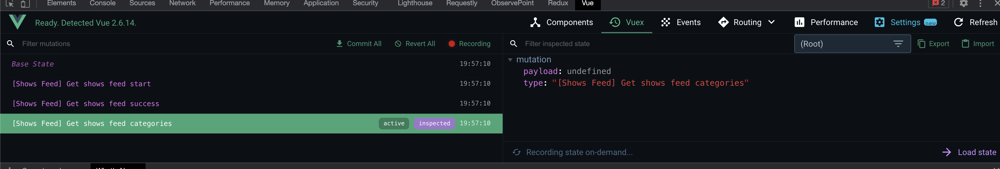

# mazeflix


## Project setup
```
npm install
```

### Compiles and hot-reloads for development
```
npm run serve
```

### Run test cases
```
npm run test
```


Packages I used:
- Loadash debounce, for the search
- Bootstrap for basic styles and icons(<b-icon>) available in the project
- Vue carousel for display the carousel for the home-v2

### Remarks
- The UI is inspired by Netflix website
- I have two versions of the home page. Since the goal of the assignment was to display images preferably horizontal, 
I did a first home page using Vue carousel. I wasn't quite happy with the performance of it, so I decided 
to create another home page, but I kept anyway the version with the carousel (/home-v2)
- The results are displayed on the page ordered by category and sorted by rating (highest to lowest).
- It Is possible to perform a search with the search bar on the top right which navigates to /search route
- From both home and search page it is possible to navigate to the detail page
- The website is responsive
- I set a very small styleguide with the idea of keeping styles like fonts, colors, sizes and a few classes reusable and consistent
- Since I'm used to angular and this is the very first time I do something with Vue, I used a pattern for Vuex which would
display in the dev tools logs for actions and mutations Redux style.
  
- At the top of the page I've added a section for categories. By clicking on one of them the page will be scrolled to the selected category section.
- Loader is displayed while api call is performing
- Error handling in the UI

### Missings due expired time
- Not all test cases are performed 
- Could have improved a little bit the user experience of the home dashboard by adding a scroll up button on the bottom of the page